# 🎵 Music Player

A modern, feature-rich Android Music Player built entirely with **Kotlin** and **Jetpack Compose**, following the **MVVM Architecture**. The application provides an elegant UI, playlist management, artist browsing, favorites, local music playback, and a beautiful user experience with Material Design 3.

---

## 📱 Screenshots

>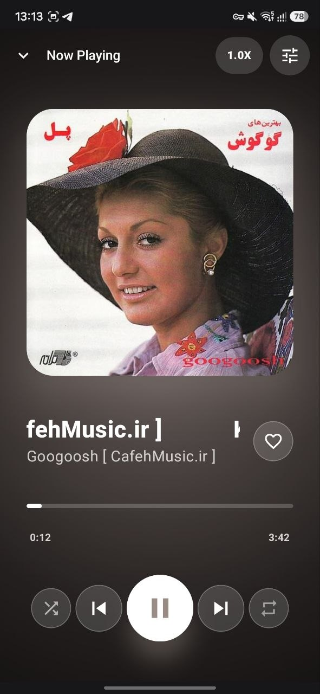
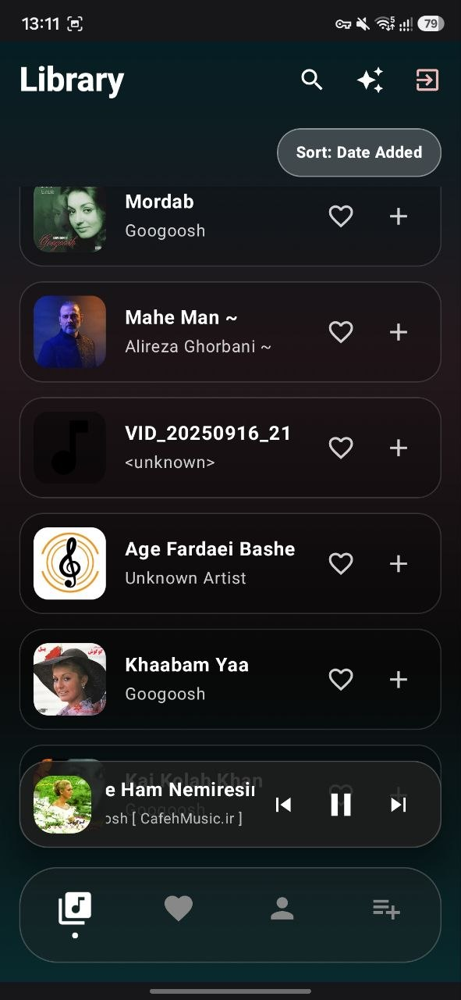
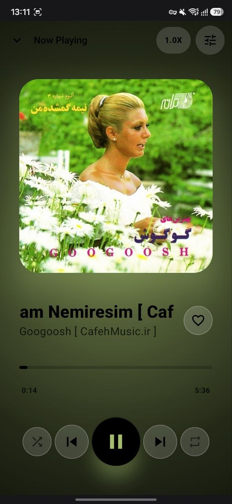
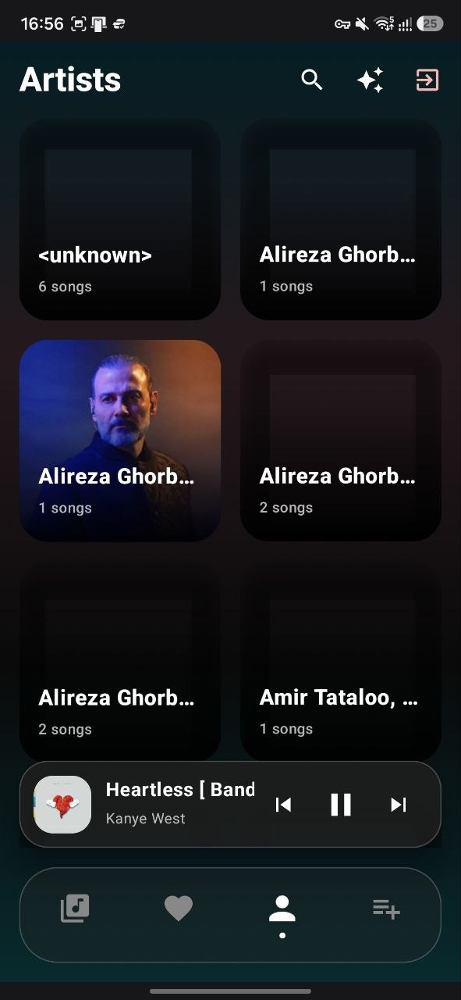 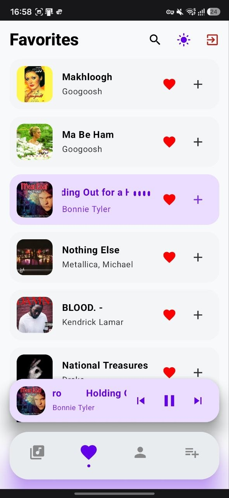  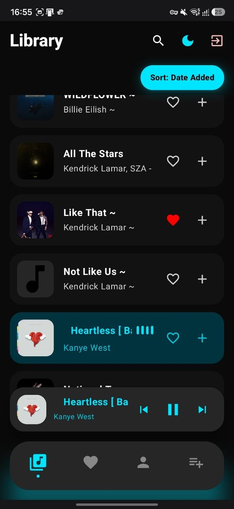 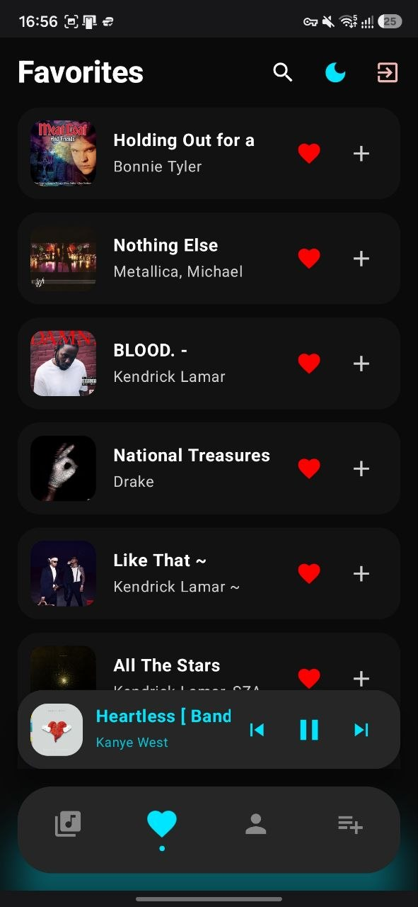 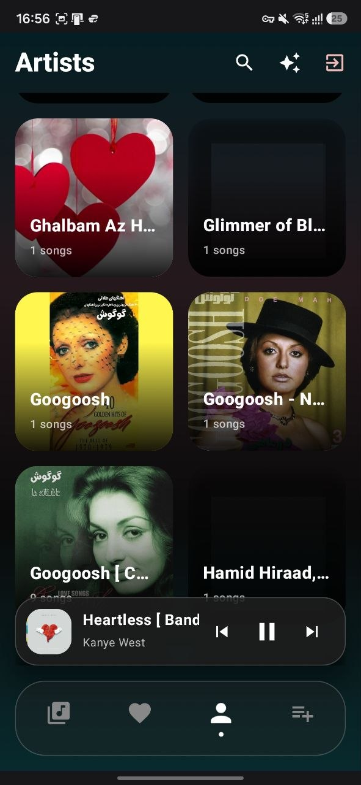 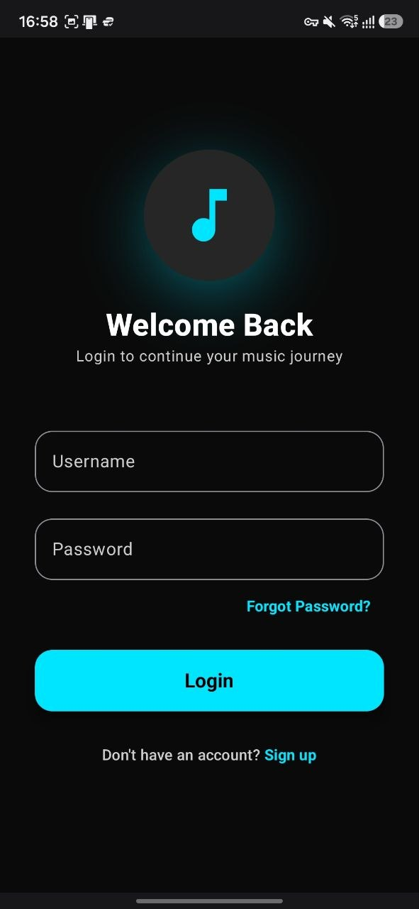 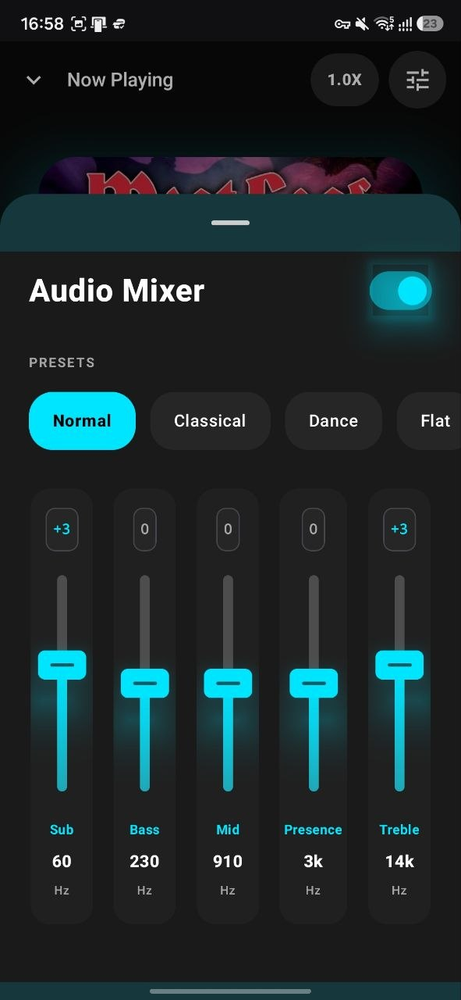  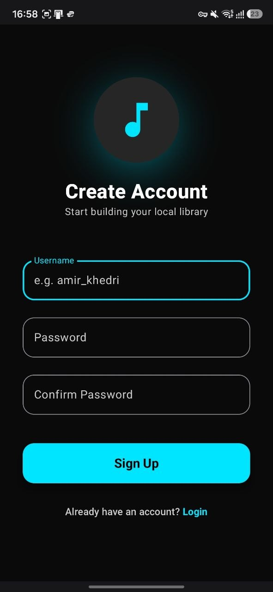
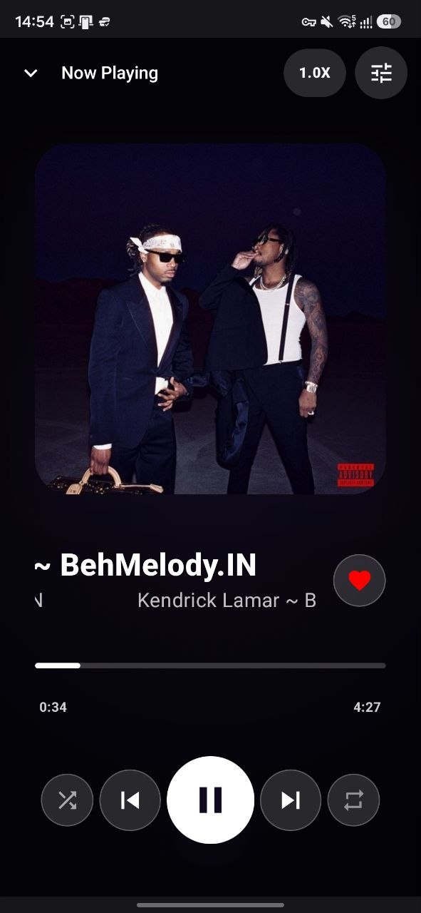

| Library | Player | Artists | Playlists |
|---------|----------|----------|------------|
| Screenshot | Screenshot | Screenshot | Screenshot |

---

# ✨ Features

### 🎼 Music Library
- Scan and display all local audio files
- Beautiful song cards with album artwork
- Sort songs by:
  - Name
  - Artist
  - Date Added
- Instant search
- Multi-selection mode
- Rename songs
- Delete songs
- Share songs

---

### ❤️ Favorites

- Add/remove favorite songs
- Dedicated Favorites screen
- Search favorites instantly

---

### 👨‍🎤 Artists

- Automatically groups songs by artist
- Artist artwork support
- Artist detail page
- Search artists
- Search songs inside each artist

---

### 🎶 Playlists

- Create unlimited playlists
- Rename playlists
- Delete playlists
- Add songs to playlists
- Remove songs from playlists
- Playlist search
- Beautiful playlist artwork

---

### ▶️ Music Playback

- Play/Pause
- Skip Next
- Skip Previous
- Queue Playback
- Mini Player
- Currently Playing Indicator
- Animated Playing Visualizer
- Album Artwork Support

---

### 🌙 UI & UX

- Material Design 3
- Dynamic Light/Dark Theme
- Smooth Animations
- Responsive Layout
- Beautiful Card Design
- Modern Bottom Navigation
- Search Animations

---

### 🔐 Authentication

- Login
- Logout
- Session Management

---

## 🏗 Architecture

The project follows the **MVVM (Model-View-ViewModel)** architecture.

```
Presentation
│
├── UI (Jetpack Compose)
├── ViewModels
│
Domain
│
├── Repository
├── Business Logic
│
Data
│
├── Room Database
├── MediaStore
├── Preferences
└── Local Storage
```

---

# 🛠 Built With

- Kotlin
- Jetpack Compose
- Material Design 3
- MVVM Architecture
- Hilt (Dependency Injection)
- Kotlin Coroutines
- StateFlow
- Navigation Compose
- Room Database
- Coil
- Android MediaStore
- Android Storage Access Framework
- ExoPlayer / Media3
- DataStore
- AndroidX

---

# 📂 Project Structure

```
app/
│
├── data/
│   ├── model/
│   ├── repository/
│   └── local/
│
├── ui/
│   ├── screens/
│   ├── components/
│   └── theme/
│
├── viewmodel/
│
├── navigation/
│
├── service/
│
└── MainActivity.kt
```

---

# 🚀 Getting Started

## Prerequisites

- Android Studio Meerkat (or newer)
- Android SDK 35+
- Kotlin 2.x
- Gradle 8+

---

## Installation

Clone the repository

```bash
git clone https://github.com/amirkhedri/Music-Player-Android-App
```

Open in Android Studio

```
File → Open
```

Sync Gradle

Run the application on

- Android Emulator
- Physical Device (Android 8.0+)

---

# 📋 Permissions

The application requires the following permissions:

```xml
READ_MEDIA_AUDIO
READ_EXTERNAL_STORAGE
WRITE_EXTERNAL_STORAGE (Legacy)
FOREGROUND_SERVICE
POST_NOTIFICATIONS
```

Depending on Android version, runtime permissions are requested automatically.

---

# 📦 Libraries Used

| Library | Purpose |
|----------|----------|
| Jetpack Compose | UI |
| Navigation Compose | Navigation |
| Hilt | Dependency Injection |
| Room | Local Database |
| Coil | Image Loading |
| Media3 / ExoPlayer | Audio Playback |
| DataStore | Preferences |
| Coroutines | Async Programming |
| StateFlow | UI State |

---

# 🎯 App Workflow

```
Login
   │
   ▼
Library
   │
   ├── Favorites
   ├── Artists
   │      └── Songs
   ├── Playlists
   │      └── Playlist Songs
   └── Player
```

---

# 📸 Main Screens

- Login
- Library
- Favorites
- Artists
- Artist Details
- Playlists
- Playlist Details
- Full Music Player

---

# 🎨 Design Principles

- Material Design 3
- Responsive Layout
- Modern Animations
- Smooth User Experience
- Minimalistic Interface
- Accessibility Friendly

---

# 🔒 Data Management

The application stores:

- Favorite songs
- Custom playlists
- Theme preferences
- User session

All data is stored locally on the device.

---

# ⚡ Performance Optimizations

- LazyColumn
- LazyVerticalGrid
- remember {}
- StateFlow
- Coroutines
- Image caching with Coil
- Efficient recomposition
- MediaStore querying

---

# 🔮 Future Improvements

- Lyrics Support
- Equalizer
- Sleep Timer
- Recently Played
- Most Played
- Album Screen
- Folder Browser
- Shuffle All
- Repeat Modes
- Cloud Backup
- Online Streaming
- Wear OS Support
- Android Auto Support
- Chromecast

---

# 🤝 Contributing

Contributions are welcome!

1. Fork the repository

2. Create a feature branch

```bash
git checkout -b feature/NewFeature
```

3. Commit changes

```bash
git commit -m "Add New Feature"
```

4. Push

```bash
git push origin feature/NewFeature
```

5. Open a Pull Request

---

# 👨‍💻 Author

**Amir Khedri**

Computer Engineering Student

University of Isfahan

---

# 📄 License

This project is licensed under the MIT License.

```
MIT License

Copyright (c) 2026 Amir Khedri

Permission is hereby granted, free of charge,
to any person obtaining a copy of this software...
```

---

# ⭐ If you like this project

Give it a ⭐ on GitHub!

It helps support the project and motivates future development.

---

## 📧 Contact

GitHub: https://github.com/amirkhedri

Email: khedria95@gmail.com