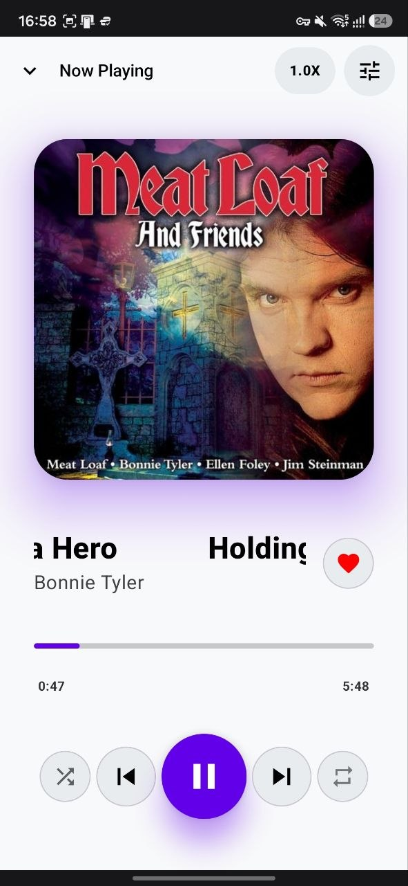
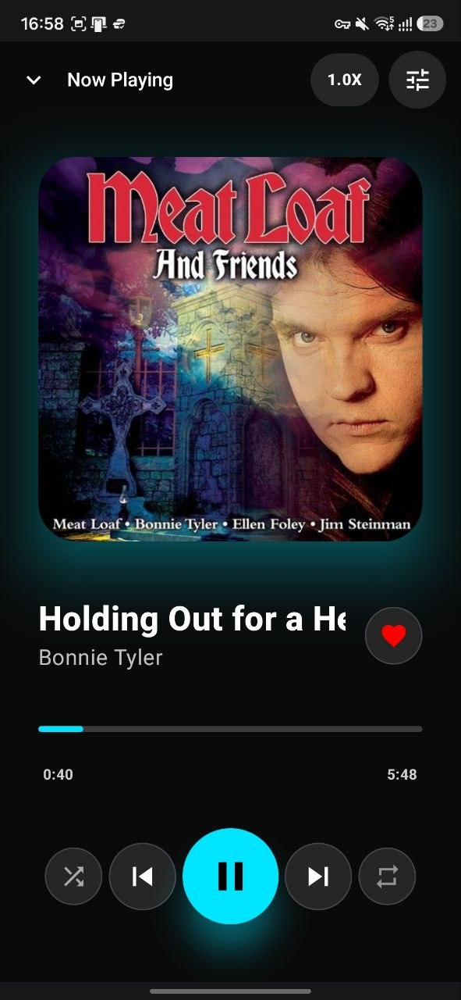
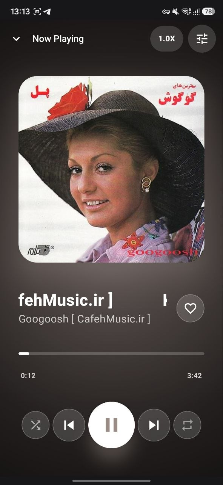

<h1 align="center">🎵 Music Player Android App</h1>

<p align="center">
  
  
  
  
</p>

> A modern, feature-rich music player for Android, built entirely with Kotlin and Jetpack Compose. This application leverages the MVVM architecture to provide a clean, scalable, and maintainable codebase. It offers a beautiful user experience with Material Design 3, dynamic theming (Light, Dark, and Glassy), and a comprehensive set of features for local music playback.

---

## 📱 Screenshots

### 🔑 Authentication & Settings
| Login Screen | Create Account | Equalizer |
| :---: | :---: | :---: |
|  |  |  |

### 🎶 Library & Discovery
| Light Library | Dark Library | Artists View |
| :---: | :---: | :---: |
|  |  |  |

### ▶️ Playback Experience
| Light Player | Dark Player | Glassy Theme |
| :---: | :---: | :---: |
|  |  |  |

### ❤️ Favorites & Immersive UI
| Favorites | Playback Visualization | Immersive Controls |
| :---: | :---: | :---: |
|  |  |  |

---

## ✨ Features

* **Authentication:** Secure user login and registration system with session management. Includes a "Forgot Password" feature.
* **Music Library:** Automatically scans and displays all local audio files from the device's MediaStore.
* **Sorting & Searching:** Sort your music library by Title, Artist, or Date Added. Instantly search across your library, favorites, playlists, and artists.
* **Playback Control:** Full playback functionality including play/pause, skip next/previous, seek, and a mini-player for background control.
* **Queue Management:** Play songs from a list, starting at any track.
* **Favorites & Playlists:** Add/remove songs to a dedicated favorites list and create, rename, or delete an unlimited number of custom playlists.
* **Artists View:** Automatically groups songs by artist, displaying artist-specific views with their respective tracks.
* **Advanced Player UI:**
    * Immersive full-screen player dynamically adapts its color scheme based on the album art.
    * Animated playback visualizer.
    * Control playback speed (**0.5x to 2.0x**).
    * Shuffle and Repeat (off, repeat one, repeat all) modes.
* **Dynamic Theming:**
    * **Light Mode:** A clean, bright interface.
    * **Dark Mode:** An elegant, eye-friendly theme.
    * **Glassy Mode:** A premium, frosted-glass effect with dynamic colors.
* **Built-in Equalizer:** A powerful 5-band audio equalizer with multiple presets (e.g., Pop, Rock, Jazz) and custom band level controls.
* **File Management:** Multi-select songs to share, delete, or add to a playlist. Rename individual song titles.

---

## 🛠️ Tech Stack & Architecture

This project is built with a modern Android tech stack, strictly following the **MVVM (Model-View-ViewModel)** architecture pattern for robust separation of concerns.

* **UI:** [Jetpack Compose](https://developer.android.com/jetpack/compose) for building the entire UI declaratively.
* **Dependency Injection:** [Hilt](https://dagger.dev/hilt/) for managing dependencies and scopes.
* **Asynchronous Programming:** Kotlin Coroutines and Flow for managing background tasks and data streams.
* **Navigation:** Navigation Compose for navigating between screens.
* **Database & Persistence:** [Room](https://developer.android.com/training/data-storage/room) for persisting user data, playlists, and favorites. DataStore for managing user sessions.
* **Media Playback:** [Media3 (ExoPlayer)](https://developer.android.com/media/media3) for robust audio playback and background media session management.
* **Image Loading:** [Coil](https://coil-kt.github.io/coil/) for efficiently loading and caching album art.

---

## 🚀 Getting Started

### Prerequisites

* Android Studio Iguana or newer
* Android SDK 26 (Oreo) or higher

### Installation

1. **Clone the repository:**
   ```bash
   git clone [https://github.com/amirkhedri/Music-Player-Android-App.git](https://github.com/amirkhedri/Music-Player-Android-App.git)
Open the project in Android Studio.

Sync project dependencies with Gradle.

Run the application on an Android emulator or a physical device.

Note: The app will request permissions to read audio files from your device on the first launch. Please grant these permissions to successfully populate the music library.

📁 Project Structure

.
└── app/
    ├── src/
    │   ├── main/
    │   │   ├── java/com/example/musicplayer/
    │   │   │   ├── data/
    │   │   │   │   ├── local/        # Room Database, DAOs, Entities, DataStore
    │   │   │   │   ├── model/        # Data models like Song
    │   │   │   │   └── repository/   # Repositories for data access
    │   │   │   ├── di/               # Hilt dependency injection modules
    │   │   │   ├── player/           # Media3/ExoPlayer integration
    │   │   │   ├── ui/
    │   │   │   │   ├── navigation/   # AppNavGraph routes
    │   │   │   │   ├── screens/      # Composable screens (Login, Library, etc.)
    │   │   │   │   └── theme/        # Color schemes, typography
    │   │   │   └── viewmodel/        # ViewModels for each feature
    │   │   ├── AndroidManifest.xml   # App permissions and services
    │   │   └── res/                  # App resources (drawables, styles)
    └── build.gradle.kts              # App-level dependencies
📄 License
This project is licensed under the MIT License. See the LICENSE file for details.